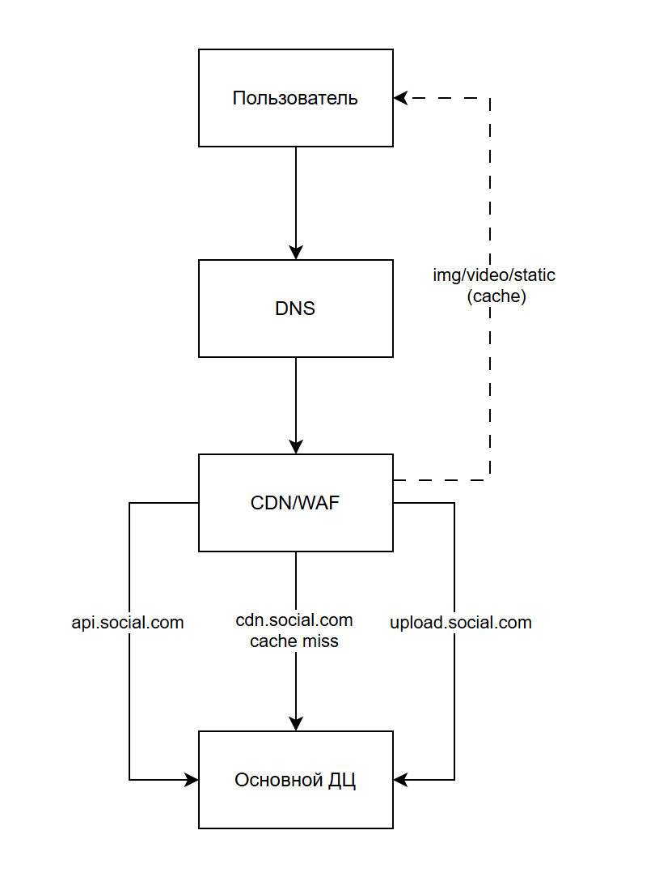
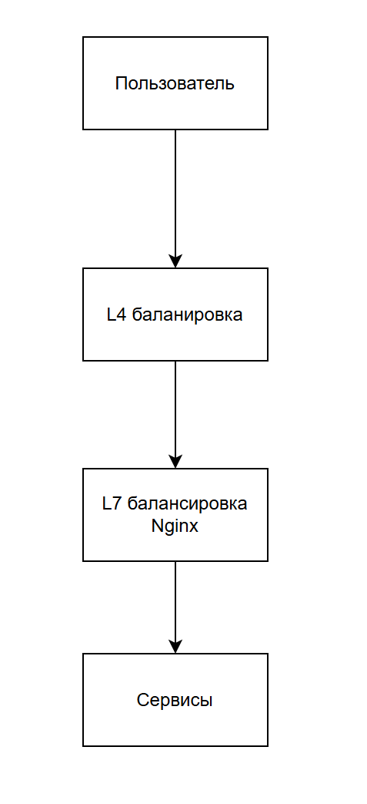
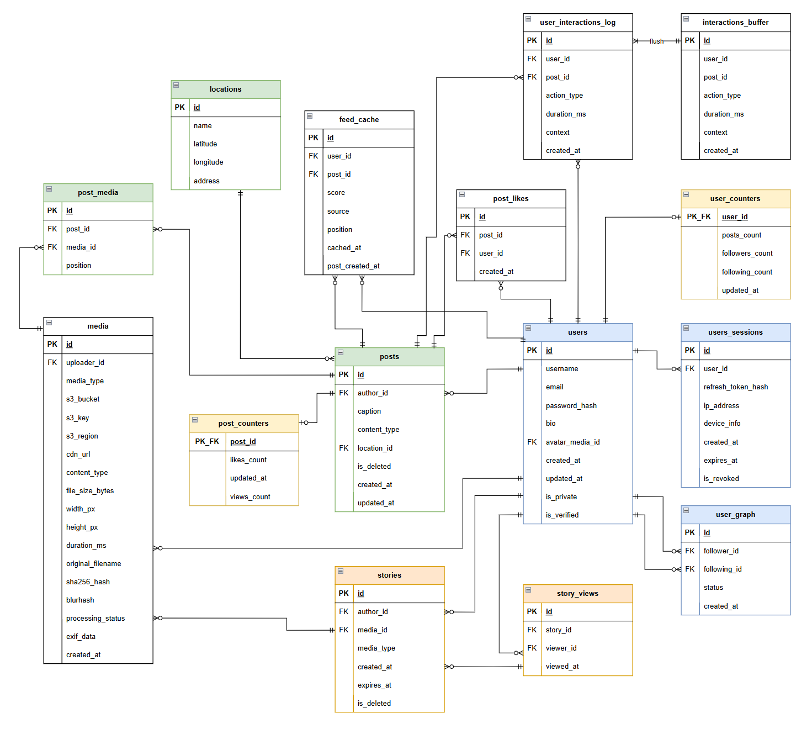

# 1. Тема и целевая аудитория

Социальная сеть для просмотра фото- и видео- контента

## 1.1 Аналоги
Среди аналогов можно выделить Instagram, TikTok, Vk, Facebook, Snapchat, Pinterest и другие

## 1.2 Аудитория

**Основная аудитория:** люди в возрасте от 13 до 65 лет, где самая активная группа: мужчины и женщины в возрасте от 25 до 34 лет (17,9%) [[1]](https://datareportal.com/reports/digital-2022-instagram-headlines?rq=instagram)

**География:** сервис ориентирован на пользователей из России

**Охват аудитории:** по данным [[19]](https://stats.napoleoncat.com/social-media-users-in-russian_federation/2021/) число активных пользователей Instagram за месяц составлят 60.7 млн в России.

## 1.3 Требования к функционалу

1. Публикация контента (фото или видео)
2. Просмотр ленты
3. Оценка понравившегося контента
4. Публикация историй
5. Просмотр историй

## 1.4 Метрики

| Метрика | Значение | Описание |
| :--- | :--- | :--- |
| MAU | 60.7 [[19]](https://stats.napoleoncat.com/social-media-users-in-russian_federation/2021/) | Количество пользователей в месяц |
| DAU | 33 млн [[20]](https://wciom.com/press-release/russian-users-of-social-media-and-messengers-changes-amidst-the-special-operation) | Количество пользователей в день |
| Посты в месяц | 17 шт [[4]](https://buffer.com/resources/instagram-engagement-rate/) | Среднее кол-во публикаций в месяц |
| Тип публикуемого контента | 5.3 - фото, 2.4 - карусель, 2.3 - reels [[5]](https://metricool.com/instagram-research-study-2023/) | Распределение контента на 10 публикаций |
| Тип контента в stories | 57% фото, 43% видео [[10]](https://www.socialinsider.io/social-media-benchmarks/instagram-stories-benchmarks/) | Распределение контента в сторис |
| Кол-во подписчиков | 1k - 10k [[9]](https://mention.com/en/reports/instagram/followers/) | Медианное значение кол-ва подписчиков на один аккаунт |
| Просмотр Reels | 30% [[12]](https://www.outfame.com/blog/instagram-reels-statistics/) | Процент проведенный за просмотр Reels относительно всего времени, проведенного в приложении |
| Просмотр Stories | 20% [[12]](https://backlinko.com/instagram-users/) | Процент проведенный за просмотр Stories относительно всего времени, проведенного в приложении |
| Скролл ленты | 35% [[12]](https://backlinko.com/instagram-users/) | Процент проведенный за скроллом ленты относительно всего времени, проведенного в приложении
| Время в Instagram | 33.9 минут [[12]](https://backlinko.com/instagram-users/) | Время проведенное пользователем в Instagram за день в среднем |

# 2. Расчет нагрузки

## 2.1 Продуктовые метрики
### Сводная таблица
| Метрика | Значение |
| :--- | :--- |
| MAU | 60.7 [[19]](https://stats.napoleoncat.com/social-media-users-in-russian_federation/2021/) |
| DAU | 33 млн [[20]](https://wciom.com/press-release/russian-users-of-social-media-and-messengers-changes-amidst-the-special-operation) |
| Средний размер хранилища пользователя | 5.78 Гб |
| Среднее количество действий пользователя в день | 182.09 |

### Средний размер хранилища пользователя
Исходя из [[2]](https://www.statista.com/statistics/272014/global-social-networks-ranked-by-number-of-users/) и [[3]]( https://www.demandsage.com/instagram-statistics/) посчитаем средний возраст одного аккаунта Instagram
| Год | Число пользователей | Разница с предыдущим годом | Возраст |
| :--- | :--- | :--- | :--- |
| 2013 | 110 млн | 110 млн | 13 лет |
| 2014 | 200 млн | 90 млн | 12 лет |
| 2015 | 370 млн | 170 млн | 11 лет |
| 2016 | 500 млн | 130 млн | 10 лет |
| 2017 | 700 млн | 200 млн | 9 лет |
| 2018 | 1 млрд | 300 млн | 8 лет |
| 2019 | 1.1 млрд | 100 млн | 7 лет |
| 2020 | 1.3 мдрд | 200 млн | 6 лет |
| 2021 | 2 млрд | 700 млн | 5 лет |
| 2022 | 2.3 мдрд | 300 млн | 4 года |
| 2023 | 2.4 мдрд | 100 млн | 3 года |
| 2025 | 3 млрд | 600 млн | 1 год |

Тогда средний возраст аккаунта в Instagram расчитывается как:

$$
\frac{
13 * 110 + 12 * 90 + 11 * 170 + 10 * 130 + 9 * 200 + 8 * 300 + 7 * 100 + 6 * 200 + 5 * 700 + 4 * 300 + 3 * 100 + 1 * 600
}{
3000
} = 5.793
$$

Найдем средний объем данных для пользователя:
| Тип данных | Среднее кол-во в месяц, шт | Размер 1 единицы | Средний срок хранения (лет) | Всего, шт | Всего | Расчет |
| :--- | :--- | :--- | :--- | :--- | :--- | :--- |
| Фото | 9.01 | 250 Кб | 5.793 | 626.34 | 156.59 Мб | Кол-во: 17 постов * 0.53 доля постов с фото (раздел 1.4) |
| Видео (reels) | 3.91 | 7 Мб | 5.793 | 271.81 | 1.9 Гб | Кол-во: 17 постов * 0.23 для постов с видео (раздел 1.4) |
| Stories | 17 [[10]](https://www.socialinsider.io/social-media-benchmarks/instagram-stories-benchmarks/) | 3.15 Мб | 5.793 | 1181.77 | 3.72 Гб | Кол-во Мб: 250 Кб * 0.57 + 7 Мб * 0.43 (раздел 1.4) |
| **Итого** |  |  |  | **2079.92** | **5.78 Гб** |

### Среднее количество действий пользователя в день
| Действие | Среднее, шт | Пояснение
| :--- | :--- | :--- |
| Вход/загрузка ленты | 7 [[11]](https://afftank.com/blog/instagram-statistics/) | - |
| Просмотр постов | 71.19 | 35% времени на ленту из общего времени 33.9 минут (раздел 1.4). Один пост до 10 секунд |
| Просмотр Reels | 30 | 30% времени на Reels из общего времени 33.9 минут (раздел 1.4). Один Reels 15-20 секунд |
| Просмотр Stories | 52.9 | 20% времени на Stories из общего времени 33.9 минут (раздел 1.4). Одна Stories 5-7 секунд |
| Лайки и комментарии | 20 [[13]](https://eathealthy365.com/how-many-daily-likes-does-instagram-really-get/) | - |
| Публикация фото | 0.3 | Из расчета 9.01 в месяц |
| Публиакция Reels | 0.13 | Из расчета 3.91 в месяц |
| Публикация Stories | 0,57 | Из расчета 17 в месяц |
| **Итого** | **182.09** |

## 2.2 Технические метрики
### Сводная таблица
| Метрика | Значение |
| :--- | :--- |
| Хранилище | 17 330 Пб |
| Суммарный суточный трафик | 13.10 Пб |
| Средняя нагрузка | 1 214 Гбит/с |
| Пиковая нагрузка | 3 641 Гбит/с |
| RPS (средний) | 69 548 |
| RPS (пиковый, ×3) | 208 645 |

### Хранилище
Для 60.7 млн активных пользователей в месяц [[19]](https://stats.napoleoncat.com/social-media-users-in-russian_federation/2021/)
| Тип данных | Значение для одного пользователя, шт | Значение для одного пользователя | Общее значение, млрд шт | Общее значение, Пб |
| :--- | :--- | :--- | :--- | :--- |
| Фото | 626.34 | 156.59 Мб | 38.02 | 9.51 | 
| Видео | 271.81 | 1.9 Гб | 16.50 | 115.33 |
| Stories | 1181.77 | 3.72 Гб | 71.73 | 225.80 |
| **Итого** |  |  | **126.25 млрд** | **350.64 Пб** |  

### Сетевой трафик
Суточный трафик на 33 млн пользователей [[20]](https://wciom.com/press-release/russian-users-of-social-media-and-messengers-changes-amidst-the-special-operation). Пиковую нагрзуку возьмем ×3 относительно средней нагрузки [[15]](https://www.designgurus.io/answers/detail/how-do-you-estimate-capacity-rpsstoragebandwidth-for-a-social-app)

<table>
  <tr>
    <td rowspan="4"><strong>Трафик на скачивание контента</strong></td>
    <td><strong>Действие</strong></td>
    <td><strong>Суточный объем, Тб</strong></td>
    <td><strong>Средняя нагрузка, Гбит/с</strong></td>
    <td><strong>Пиковая нагрузка (×3), Гбит/с</strong></td>
    <td><strong>Расчет</strong></td>
  </tr>
  <tr>
    <td>Просмотр ленты</td>
    <td>587.32</td>
    <td>54.38</td>
    <td>163.14</td>
    <td>33 млн * 71.19 * 250 Кб</td>
  </tr>
  <tr>
    <td>Просмотр Reels</td>
    <td>6 930</td>
    <td>641.67</td>
    <td>1 925</td>
    <td>33 млн * 30 * 7 Мб</td>
  </tr>
  <tr>
    <td>Просмотр Stories</td>
    <td>5 498</td>
    <td>509.16</td>
    <td>1 527</td>
    <td>33 млн * 52.9 * 3.15 Мб</td>
  </tr>
  <tr>
    <td rowspan="3"><strong>Трафик на загрузку контента</strong></td>
    <td>Публикация фото</td>
    <td>2.48</td>
    <td>0.23</td>
    <td>0.69</td>
    <td>33 млн * 0.3 * 250 Кб</td>
  </tr>
  <tr>
    <td>Публикация Reels</td>
    <td>30.03</td>
    <td>2.78</td>
    <td>8.34</td>
    <td>33 млн * 0.13 * 7 Мб</td>
  </tr>
  <tr>
    <td>Просмотр Stories</td>
    <td>59.25</td>
    <td>5.49</td>
    <td>16.46</td>
    <td>33 млн * 0.57 * 3.15 Мб</td>
  </tr>
  <tr>
    <td><strong>Итого</strong></td>
    <td></td>
    <td><strong>13.10 Пб</strong></td>
    <td><strong>1 214</strong></td>
    <td><strong>3 641</strong></td>
    <td></td>
  </tr>
</table>

### RPS

<table>
  <tr>
    <td rowspan="5"><strong>Запросы на чтение</strong></td>
    <td><strong>Действие</strong></td>
    <td><strong>Суточное количество, млн</strong></td>
    <td><strong>RPS (средний)</strong></td>
    <td><strong>RPS (пиковый, ×3)</strong></td>
    <td><strong>Расчет</strong></td>
  </tr>
  <tr>
    <td>Вход/загрузка ленты</td>
    <td>231</td>
    <td>2 673</td>
    <td>8 021</td>
    <td>33 млн * 7</td>
  </tr>
  <tr>
    <td>Просмотр постов (лента)</td>
    <td>2 349</td>
    <td>27 191</td>
    <td>81 571</td>
    <td>33 млн * 71.19</td>
  </tr>
  <tr>
    <td>Просмотр Reels</td>
    <td>990</td>
    <td>11 458</td>
    <td>34 375</td>
    <td>33 млн * 30</td>
  </tr>
  <tr>
    <td>Просмотр Stories</td>
    <td>1 746</td>
    <td>20 205</td>
    <td>60 615</td>
    <td>33 млн * 52.9</td>
  </tr>
  <tr>
    <td rowspan="4"><strong>Запросы на запись</strong></td>
    <td>Лайки</td>
    <td>660</td>
    <td>7 639</td>
    <td>22 916</td>
    <td>33 млн * 20</td>
  </tr>
  <tr>
    <td>Публикация фото</td>
    <td>9.9</td>
    <td>114.58</td>
    <td>343.75</td>
    <td>33 млн * 0.3</td>
  </tr>
  <tr>
    <td>Публикация Reels</td>
    <td>4.29</td>
    <td>49.65</td>
    <td>148.96</td>
    <td>33 млн * 0.13</td>
  </tr>
  <tr>
    <td>Публикация Stories</td>
    <td>18.81</td>
    <td>217.71</td>
    <td>653.13</td>
    <td>33 млн * 0.57</td>
  </tr>
  <tr>
    <td colspan="2"><strong>Итого</strong></td>
    <td><strong>6 млрд</strong></td>
    <td><strong>69 548</strong></td>
    <td><strong>208 645</strong></td>
    <td></td>
  </tr>
</table>

# 3. Глобальная балансировка нагрузки
## 3.1 Разбиение по доменам
| Домен | Функциональность |
| :--- | :--- | 
| `api.social.com` | Лента, посты, лайки, metadata, пользователи | 
| `cdn.social.com` | Фото, reels, stories | 
| `upload.social.com` | Загрузка контента |

## 3.2 Расположение ДЦ
Было принято решение разместить 1 ДЦ в Москве по следующим причинам:

- снизить сложность инфраструктуры (нет replication, failover, GeoDNS);
- упростить консистентность данных (один источник истины);
- сократить стоимость разработки и поддержки;

## 3.3 Схема глобальной балансировки

# 4. Локальная балансировка нагрузки
## 4.1. Схема локальной балансировки
Поскольку большинство облачных провайдеров предоставляют управляемые сервисы L4-балансировки было принято решение отказаться от развертывания собственных и использовать облачные решения 

Для терминации SSL и маршрутизации HTTP-запросов используются собственные L7-балансировщики на базе NGINX

Для снижения нагрузки на CPU при установке TLS-соединений используется механизм SSL Session Tickets

## 4.2. Расчет количество балансировщиков

### Метрики для расчета
Исходя из [[17]](https://blog.nginx.org/blog/testing-performance-nginx-ingress-controller-kubernetes) исходные данные для Ingress Controller, 2019

| Метрика | 16 ядер | С запасом, 50% |
| :--- | :--- | :--- |
| HTTPS RPS | 341 232 | ~170 000 |
| SSL TPS | 56 175 | ~28 000 |
| Throughput | 8.8 Гбит/с | 8.8 Гбит/с |

Метрики из предыдущих разделов:

| Метрика | Значение |
| :--- | :--- |
| Пиковый RPS | 208 645 |
| Пиковый TPS (30% от RPS) | ~62 000 |
| Трафик через NGINX | ~123 Гбит/с |

Трафик через NGINX высчитывается как 5% трафика через cdn (cache miss) + трафик на загрузку + трафик на api:
1 214 Гбит/с * 0.05 + 25.46 Гбит/с + 1 214 Гбит/с * 0.03 = 122.58 Гбит/с

### Расчеты
| Метрика | Расчет | Кол-во экземпляров |
| :--- | :--- | :--- |
| RPS | 208 645 / 170 000 | ~2 |
| SSL TPS | 62 000 / 28 000 | ~3 |
| Пропускная способность сети | 123 Гбит/с / 8.8 Гбит/с | ~14 |

Таким образом, основным ограничителем является пропускная способность сети. Берем схему N+1 и тогда **итоговое количество балансировщиков - 15**

# 5. Логическая схема БД

## 5.1. Схема БД

## 5.2. Описание таблиц БД

| Таблица | Описание |
|---------|------------|
| `users` | Основная таблица пользователей. Содержит учётные данные, профиль, флаг приватности, полнотекстовый поиск по нику (search_vector) |
| `user_sessions` | Активные сессии пользователей. Хранит refresh-токены, информацию об устройстве, IP Поддерживает отзыв сессий (is_revoked) |
| `user_graph` | Граф подписок. Поле status управляет подтверждением для приватных аккаунтов |
| `media` | Метаданные медиафайлов, хранящихся в S3 |
| `posts` | Посты пользователей. Поддерживает мягкое удаление |
| `post_media` | Связующая таблица между постами и медиафайлами |
| `locations` | Геолокации, привязанные к постам |
| `stories` | Истории пользователей. Автоматически удаляются через 24 часа после создания (expires_at) |
| `story_views` | Факты просмотра историй |
| `post_likes` | Лайки к постам |
| `post_counters` | Предрасчитанные счётчики поста |
| `user_counters` | Предрасчитанные счётчики пользователя (посты, подписчики, подписки) |
| `feed_cache` | Материализованная лента пользователя |
| `interactions_buffer` | Буфер для записи действий пользователей. Используется для пакетной вставки в основную таблицу |
| `user_interactions_log` | Основное хранилище всех взаимодействий пользователя с контентом. Используется для аналитики и обучения ML-моделей рекомендаций |

## 5.3. Объем хранения и нагрузка на чтение/запись

| Таблица | Средний размер строки | Суммарный объём хранения | Нагрузка на запись (QPS) | Нагрузка на чтение (QPS) |
|---------|----------------------|-------------------------|-------------------------|-------------------------|
| `users` | 220 байт | 13.3 ГБ | 0.18 | 2 600 |
| `user_sessions` | 227 байт | 13.7 ГБ | 2 600 | 70 000 |
| `user_graph` | 48 байт | ~95 ГБ | 1 500 | 10 000 |
| `media` | 768 байт | ~88 ТБ | 115 | 5 000 |
| `posts` | 256 байт | ~1.6 ТБ | 115 | 8 000 |
| `post_media` | 32 байт | ~240 ГБ | 230 | 8 000 |
| `locations` | 128 байт | ~6 ГБ | 10 | 500 |
| `stories` | 128 байт | ~15 ТБ | 220 | 15 000 |
| `story_views` | 40 байт | ~25 ТБ | 20 000 | 15 000 |
| `post_likes` | 40 байт | ~120 ТБ | 7 600 | 20 000 |
| `post_counters` | 40 байт | ~16 ГБ | 7 600 | 80 000 |
| `user_counters` | 40 байт | ~2.4 ГБ | 1 500 | 30 000 |
| `feed_cache` | 64 байт | ~380 ГБ | 35 000 | 2 700 |
| `interactions_buffer` | 128 байт | ~5 ГБ | 50 000 | 0 (буфер для записи) |
| `user_interactions_log` | 96 байт | ~1.2 ПБ | 50 000 | 500 |

## 5.4. Требования к консистентности

| Таблица | Требование к консистентности | Пояснение |
|---------|---------------------------|----------|
| `users` | strong | Профиль должен быть консистентен сразу после создания/обновления. Блокировка вступает в силу немедленно |
| `user_sessions` | strong | Сессия валидна сразу после создания. Отзыв сессии должен сработать мгновенно |
| `user_graph` | eventual | Инициатор видит подписку/отписку сразу. Для остальных допустимы задержки |
| `media` | eventual | S3 - источник истины |
| `posts` | eventual | Автор видит пост сразу. Подписчики получают через feed_cache с задержкой |
| `post_media` | eventual | Связан с posts |
| `locations` | strong | Справочные данные, редко меняются |
| `stories` | eventual | Автор видит историю сразу, зрители с задержкой |
| `story_views` | eventual | Счётчик просмотров может отставать |
| `post_likes` | eventual | Счётчик лайков может отставать. post_counters компенсирует для быстрого отображения |
| `post_counters` | eventual | Счётчики должны быть близки к актуальным |
| `user_counters` | eventual | Обновляется при подписках/отписках |
| `feed_cache` | eventual | Полная перестройка фоновым процессом. Новые посты автора добавляются мгновенно |
| `interactions_buffer` | None | Буфер только для записи|
| `user_interactions_log` | eventual | Аналитика и ML-модели толерантны к задержкам |

## 5.5. Распределение нагрузки по ключам

| Таблица | Ключ | Распределение |
|---------|------|----------------------|
| `users` | `id` | Равномерное |
| `user_sessions` | `user_id` | Равномерное |
| `user_graph` | `follower_id` | Смещённое. У популярных блогеров миллионы подписчиков |
| `media` | `id` | Смещенное |
| `posts` | `author_id` | Смещённое к активным авторам |
| `post_media` | `post_id` | Смещенное (коррелирует с `posts`) |
| `locations` | `id` | Смещенное в сторону крупных городов |
| `stories` | `author_id` | Смещённое к активным авторам |
| `story_views` | `story_id` | Смещенное |
| `post_likes` | `post_id` | Экстремально смещённое |
| `post_counters` | `post_id` | Экстремальное смещенное (коррелирует с `post_likes`) |
| `user_counters` | `user_id` | Равномерное |
| `feed_cache` | `user_id` | Равномерное |
| `interactions_buffer` | - | Только запись |
| `user_interactions_log` | `user_id` | Равномерное |

# 6. Физическая схема БД

## Источники

1. https://datareportal.com/reports/digital-2022-instagram-headlines?rq=instagram
2. https://www.statista.com/statistics/272014/global-social-networks-ranked-by-number-of-users/
3. https://www.demandsage.com/instagram-statistics/
4. https://buffer.com/resources/instagram-engagement-rate/
5. https://metricool.com/instagram-research-study-2023/
6. https://tinyimagepro.com/blog/compress-photos-for-social-media/
7. https://arxiv.org/abs/2008.11317
8. https://ru.tipard.com/video/crop-video-in-instagram.html
9. https://mention.com/en/reports/instagram/followers/
10. https://www.socialinsider.io/social-media-benchmarks/instagram-stories-benchmarks/
11. https://afftank.com/blog/instagram-statistics/
12. https://backlinko.com/instagram-users/
13. https://eathealthy365.com/how-many-daily-likes-does-instagram-really-get/
14. https://xtendedview.com/instagram-marketing-statistics/
15. https://www.designgurus.io/answers/detail/how-do-you-estimate-capacity-rpsstoragebandwidth-for-a-social-app
16. https://www.theglobalstatistics.com/instagram-global-users-statistics
17. https://blog.nginx.org/blog/testing-performance-nginx-ingress-controller-kubernetes
18. https://blog.nginx.org/blog/testing-the-performance-of-nginx-and-nginx-plus-web-servers
19. https://stats.napoleoncat.com/social-media-users-in-russian_federation/2021/
20. https://wciom.com/press-release/russian-users-of-social-media-and-messengers-changes-amidst-the-special-operation