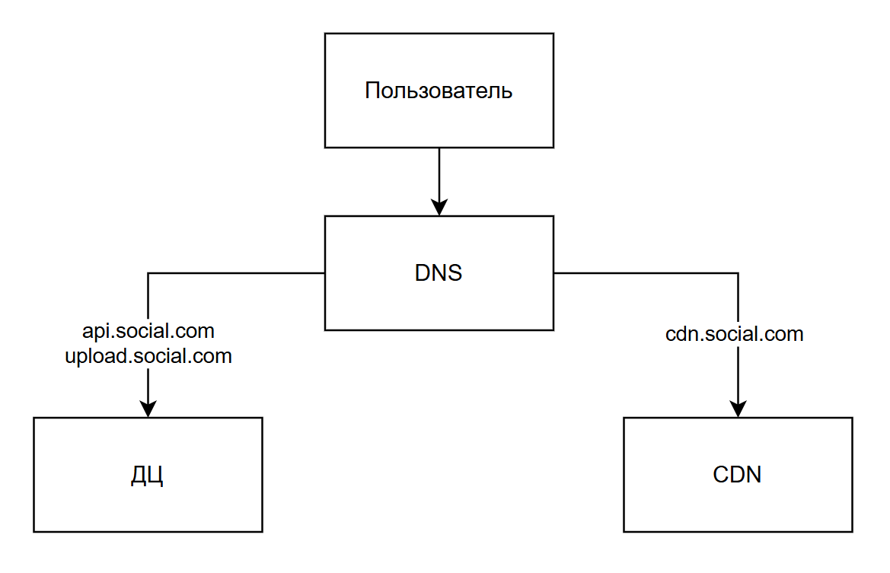
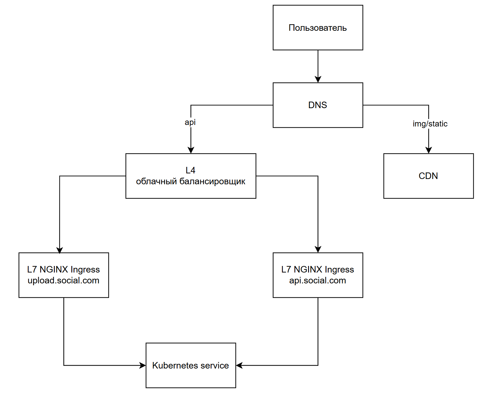
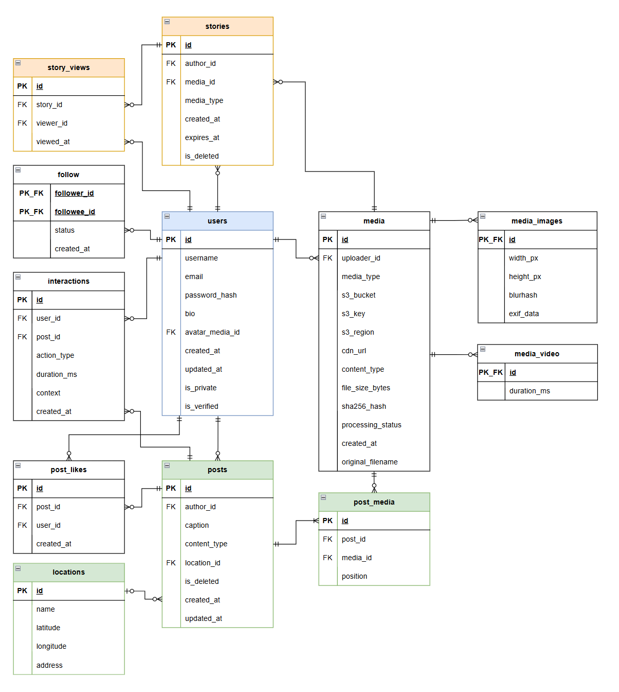
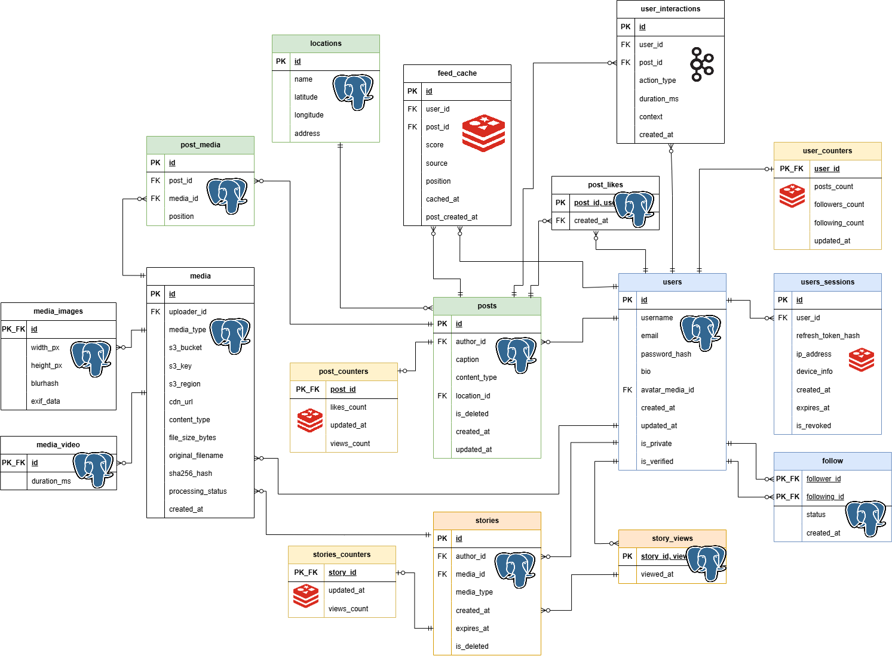

# 1. Тема и целевая аудитория

Социальная сеть для просмотра фото- и видео- контента

## 1.1 Аналоги
Среди аналогов можно выделить Instagram, TikTok, Vk, Facebook, Snapchat, Pinterest и другие

## 1.2 Аудитория

**Основная аудитория:** люди в возрасте от 13 до 65 лет, где самая активная группа: мужчины и женщины в возрасте от 25 до 34 лет (17,9%) [[1]](https://datareportal.com/reports/digital-2022-instagram-headlines?rq=instagram)

**География:** сервис ориентирован на пользователей из России

**Охват аудитории:** по данным [[19]](https://stats.napoleoncat.com/social-media-users-in-russian_federation/2021/) число активных пользователей Instagram за месяц составлят 60.7 млн в России.

## 1.3 Требования к функционалу

1. Публикация контента (фото или видео)
2. Просмотр ленты
3. Оценка понравившегося контента
4. Публикация историй
5. Просмотр историй

## 1.4 Метрики

| Метрика | Значение | Описание |
| :--- | :--- | :--- |
| MAU | 60.7 [[19]](https://stats.napoleoncat.com/social-media-users-in-russian_federation/2021/) | Количество пользователей в месяц |
| DAU | 33 млн [[20]](https://wciom.com/press-release/russian-users-of-social-media-and-messengers-changes-amidst-the-special-operation) | Количество пользователей в день |
| Посты в месяц | 17 шт [[4]](https://buffer.com/resources/instagram-engagement-rate/) | Среднее кол-во публикаций в месяц |
| Тип публикуемого контента | 5.3 - фото, 2.4 - карусель, 2.3 - reels [[5]](https://metricool.com/instagram-research-study-2023/) | Распределение контента на 10 публикаций |
| Тип контента в stories | 57% фото, 43% видео [[10]](https://www.socialinsider.io/social-media-benchmarks/instagram-stories-benchmarks/) | Распределение контента в сторис |
| Кол-во подписчиков | 1k - 10k [[9]](https://mention.com/en/reports/instagram/followers/) | Медианное значение кол-ва подписчиков на один аккаунт |
| Просмотр Reels | 30% [[12]](https://www.outfame.com/blog/instagram-reels-statistics/) | Процент проведенный за просмотр Reels относительно всего времени, проведенного в приложении |
| Просмотр Stories | 20% [[12]](https://backlinko.com/instagram-users/) | Процент проведенный за просмотр Stories относительно всего времени, проведенного в приложении |
| Скролл ленты | 35% [[12]](https://backlinko.com/instagram-users/) | Процент проведенный за скроллом ленты относительно всего времени, проведенного в приложении
| Время в Instagram | 33.9 минут [[12]](https://backlinko.com/instagram-users/) | Время проведенное пользователем в Instagram за день в среднем |

# 2. Расчет нагрузки

## 2.1 Продуктовые метрики
### Сводная таблица
| Метрика | Значение |
| :--- | :--- |
| MAU | 60.7 [[19]](https://stats.napoleoncat.com/social-media-users-in-russian_federation/2021/) |
| DAU | 33 млн [[20]](https://wciom.com/press-release/russian-users-of-social-media-and-messengers-changes-amidst-the-special-operation) |
| Средний размер хранилища пользователя | 5.78 Гб |
| Среднее количество действий пользователя в день | 182.09 |

### Средний размер хранилища пользователя
Исходя из [[2]](https://www.statista.com/statistics/272014/global-social-networks-ranked-by-number-of-users/) и [[3]]( https://www.demandsage.com/instagram-statistics/) посчитаем средний возраст одного аккаунта Instagram
| Год | Число пользователей | Разница с предыдущим годом | Возраст |
| :--- | :--- | :--- | :--- |
| 2013 | 110 млн | 110 млн | 13 лет |
| 2014 | 200 млн | 90 млн | 12 лет |
| 2015 | 370 млн | 170 млн | 11 лет |
| 2016 | 500 млн | 130 млн | 10 лет |
| 2017 | 700 млн | 200 млн | 9 лет |
| 2018 | 1 млрд | 300 млн | 8 лет |
| 2019 | 1.1 млрд | 100 млн | 7 лет |
| 2020 | 1.3 мдрд | 200 млн | 6 лет |
| 2021 | 2 млрд | 700 млн | 5 лет |
| 2022 | 2.3 мдрд | 300 млн | 4 года |
| 2023 | 2.4 мдрд | 100 млн | 3 года |
| 2025 | 3 млрд | 600 млн | 1 год |

Тогда средний возраст аккаунта в Instagram расчитывается как:

$$
\frac{
13 * 110 + 12 * 90 + 11 * 170 + 10 * 130 + 9 * 200 + 8 * 300 + 7 * 100 + 6 * 200 + 5 * 700 + 4 * 300 + 3 * 100 + 1 * 600
}{
3000
} = 5.793
$$

Найдем средний объем данных для пользователя:
| Тип данных | Среднее кол-во в месяц, шт | Размер 1 единицы | Средний срок хранения (лет) | Всего, шт | Всего | Расчет |
| :--- | :--- | :--- | :--- | :--- | :--- | :--- |
| Фото | 9.01 | 250 Кб | 5.793 | 626.34 | 156.59 Мб | Кол-во: 17 постов * 0.53 доля постов с фото (раздел 1.4) |
| Видео (reels) | 3.91 | 7 Мб | 5.793 | 271.81 | 1.9 Гб | Кол-во: 17 постов * 0.23 для постов с видео (раздел 1.4) |
| Stories | 17 [[10]](https://www.socialinsider.io/social-media-benchmarks/instagram-stories-benchmarks/) | 3.15 Мб | 5.793 | 1181.77 | 3.72 Гб | Кол-во Мб: 250 Кб * 0.57 + 7 Мб * 0.43 (раздел 1.4) |
| **Итого** |  |  |  | **2079.92** | **5.78 Гб** |

### Среднее количество действий пользователя в день
| Действие | Среднее, шт | Пояснение
| :--- | :--- | :--- |
| Вход/загрузка ленты | 7 [[11]](https://afftank.com/blog/instagram-statistics/) | - |
| Просмотр постов | 71.19 | 35% времени на ленту из общего времени 33.9 минут (раздел 1.4). Один пост до 10 секунд |
| Просмотр Reels | 30 | 30% времени на Reels из общего времени 33.9 минут (раздел 1.4). Один Reels 15-20 секунд |
| Просмотр Stories | 52.9 | 20% времени на Stories из общего времени 33.9 минут (раздел 1.4). Одна Stories 5-7 секунд |
| Лайки и комментарии | 20 [[13]](https://eathealthy365.com/how-many-daily-likes-does-instagram-really-get/) | - |
| Публикация фото | 0.3 | Из расчета 9.01 в месяц |
| Публиакция Reels | 0.13 | Из расчета 3.91 в месяц |
| Публикация Stories | 0,57 | Из расчета 17 в месяц |
| **Итого** | **182.09** |

## 2.2 Технические метрики
### Сводная таблица
| Метрика | Значение |
| :--- | :--- |
| Хранилище | 351 Пб |
| Суммарный суточный трафик | 13.10 Пб |
| Средняя нагрузка | 1 214 Гбит/с |
| Пиковая нагрузка | 3 641 Гбит/с |
| RPS (средний) | 69 548 |
| RPS (пиковый, ×3) | 208 645 |

### Хранилище
Для 60.7 млн активных пользователей в месяц [[19]](https://stats.napoleoncat.com/social-media-users-in-russian_federation/2021/)
| Тип данных | Значение для одного пользователя, шт | Значение для одного пользователя | Общее значение, млрд шт | Общее значение, Пб |
| :--- | :--- | :--- | :--- | :--- |
| Фото | 626.34 | 156.59 Мб | 38.02 | 9.51 | 
| Видео | 271.81 | 1.9 Гб | 16.50 | 115.33 |
| Stories | 1181.77 | 3.72 Гб | 71.73 | 225.80 |
| **Итого** |  |  | **126.25 млрд** | **350.64 Пб** |  

### Сетевой трафик
Суточный трафик на 33 млн пользователей [[20]](https://wciom.com/press-release/russian-users-of-social-media-and-messengers-changes-amidst-the-special-operation). Пиковую нагрзуку возьмем ×3 относительно средней нагрузки [[15]](https://www.designgurus.io/answers/detail/how-do-you-estimate-capacity-rpsstoragebandwidth-for-a-social-app)

<table>
  <tr>
    <td rowspan="4"><strong>Трафик на скачивание контента</strong></td>
    <td><strong>Действие</strong></td>
    <td><strong>Суточный объем, Тб</strong></td>
    <td><strong>Средняя нагрузка, Гбит/с</strong></td>
    <td><strong>Пиковая нагрузка (×3), Гбит/с</strong></td>
    <td><strong>Расчет</strong></td>
  </tr>
  <tr>
    <td>Просмотр ленты</td>
    <td>587.32</td>
    <td>54.38</td>
    <td>163.14</td>
    <td>33 млн * 71.19 * 250 Кб</td>
  </tr>
  <tr>
    <td>Просмотр Reels</td>
    <td>6 930</td>
    <td>641.67</td>
    <td>1 925</td>
    <td>33 млн * 30 * 7 Мб</td>
  </tr>
  <tr>
    <td>Просмотр Stories</td>
    <td>5 498</td>
    <td>509.16</td>
    <td>1 527</td>
    <td>33 млн * 52.9 * 3.15 Мб</td>
  </tr>
  <tr>
    <td rowspan="3"><strong>Трафик на загрузку контента</strong></td>
    <td>Публикация фото</td>
    <td>2.48</td>
    <td>0.23</td>
    <td>0.69</td>
    <td>33 млн * 0.3 * 250 Кб</td>
  </tr>
  <tr>
    <td>Публикация Reels</td>
    <td>30.03</td>
    <td>2.78</td>
    <td>8.34</td>
    <td>33 млн * 0.13 * 7 Мб</td>
  </tr>
  <tr>
    <td>Просмотр Stories</td>
    <td>59.25</td>
    <td>5.49</td>
    <td>16.46</td>
    <td>33 млн * 0.57 * 3.15 Мб</td>
  </tr>
  <tr>
    <td><strong>Итого</strong></td>
    <td></td>
    <td><strong>13.10 Пб</strong></td>
    <td><strong>1 214</strong></td>
    <td><strong>3 641</strong></td>
    <td></td>
  </tr>
</table>

### RPS

<table>
  <tr>
    <td rowspan="5"><strong>Запросы на чтение</strong></td>
    <td><strong>Действие</strong></td>
    <td><strong>Суточное количество, млн</strong></td>
    <td><strong>RPS (средний)</strong></td>
    <td><strong>RPS (пиковый, ×3)</strong></td>
    <td><strong>Расчет</strong></td>
  </tr>
  <tr>
    <td>Вход/загрузка ленты</td>
    <td>231</td>
    <td>2 673</td>
    <td>8 021</td>
    <td>33 млн * 7</td>
  </tr>
  <tr>
    <td>Просмотр постов (лента)</td>
    <td>2 349</td>
    <td>27 191</td>
    <td>81 571</td>
    <td>33 млн * 71.19</td>
  </tr>
  <tr>
    <td>Просмотр Reels</td>
    <td>990</td>
    <td>11 458</td>
    <td>34 375</td>
    <td>33 млн * 30</td>
  </tr>
  <tr>
    <td>Просмотр Stories</td>
    <td>1 746</td>
    <td>20 205</td>
    <td>60 615</td>
    <td>33 млн * 52.9</td>
  </tr>
  <tr>
    <td rowspan="4"><strong>Запросы на запись</strong></td>
    <td>Лайки</td>
    <td>660</td>
    <td>7 639</td>
    <td>22 916</td>
    <td>33 млн * 20</td>
  </tr>
  <tr>
    <td>Публикация фото</td>
    <td>9.9</td>
    <td>114.58</td>
    <td>343.75</td>
    <td>33 млн * 0.3</td>
  </tr>
  <tr>
    <td>Публикация Reels</td>
    <td>4.29</td>
    <td>49.65</td>
    <td>148.96</td>
    <td>33 млн * 0.13</td>
  </tr>
  <tr>
    <td>Публикация Stories</td>
    <td>18.81</td>
    <td>217.71</td>
    <td>653.13</td>
    <td>33 млн * 0.57</td>
  </tr>
  <tr>
    <td colspan="2"><strong>Итого</strong></td>
    <td><strong>6 млрд</strong></td>
    <td><strong>69 548</strong></td>
    <td><strong>208 645</strong></td>
    <td></td>
  </tr>
</table>

# 3. Глобальная балансировка нагрузки
## 3.1 Разбиение по доменам
| Домен | Функциональность |
| :--- | :--- | 
| `api.social.com` | Лента, посты, лайки, metadata, пользователи | 
| `cdn.social.com` | Фото, reels, stories | 
| `upload.social.com` | Загрузка контента |

## 3.2 Расположение ДЦ
Было принято решение разместить 1 ДЦ в Москве по следующим причинам:

- снизить сложность инфраструктуры (нет replication, failover, GeoDNS);
- упростить консистентность данных (один источник истины);
- сократить стоимость разработки и поддержки;

## 3.3 Схема глобальной балансировки

# 4. Локальная балансировка нагрузки
## 4.1. Схема локальной балансировки
Поскольку большинство облачных провайдеров предоставляют управляемые сервисы L4-балансировки было принято решение отказаться от развертывания собственных и использовать облачные решения 

Для терминации SSL и маршрутизации HTTP-запросов используются собственные L7-балансировщики на базе NGINX. Для отдачи изображений и видео используется cdn.

## 4.2. Расчет количество балансировщиков

### Метрики для расчета
Исходя из [[17]](https://blog.nginx.org/blog/testing-performance-nginx-ingress-controller-kubernetes) исходные данные для Ingress Controller, 2019

| Метрика | 16 ядер | С запасом, 50% |
| :--- | :--- | :--- |
| HTTPS CPS | 6 676 | ~3 300 |
| SSL TPS | 56 175 | ~28 000 |
| Throughput | 8.8 Гбит/с | 8.8 Гбит/с |

Метрики из предыдущих разделов по доменам:

| Домен | Пиковый RPS | Пиковый TPS (30% от RPS) | Трафик через NGINX, Гбит/с | Расчет |
| :--- | :--- | :--- | :--- | :--- |
| cdn.social.com | 8 828 | 2 648 | 181 | Запросы на чтение (81 571 + 34 375 + 60 615) * Cache miss (5%)  Трафик (163.14 + 1 925 + 1 527 Гбит/с) * Cache miss (5%) |
| upload.social.com | 1 146 | 344 | 25.49 | Запросы на запись 343.75 + 148.96 + 653.13  Трафик 0.69 + 8.34 + 16.46 Гбит/с |
| api.social.com | 207 498 | 62 249 | 10.2 | Запросы на чтение (8 021 + 81 571 + 34 375 + 60 615) + Запросы на запись (22 916)  Трафик 8 021 * 50 Кб + 81 571 * 5 Кб + 34 375 * 5 Кб + 60 615 * 5 Кб + 22 916 * 1 Кб |

### Расчеты
#### Расчеты api.social.com
| Метрика | Расчет | Кол-во экземпляров |
| :--- | :--- | :--- |
| RPS | 207 498 / 3 300 | ~63 |
| SSL TPS | 62 249 / 28 000 | ~3 |
| Пропускная способность сети | 10.2 Гбит/с / 8.8 Гбит/с | ~2 |

**Ограничитель SSL TPS - 63 + 1 балансировщиков**

#### Расчеты upload.social.com
| Метрика | Расчет | Кол-во экземпляров |
| :--- | :--- | :--- |
| RPS | 1 146 / 3 300 | ~1 |
| SSL TPS | 344 / 28 000 | ~1 |
| Пропускная способность сети | 25.49 Гбит/с / 8.8 Гбит/с | ~3 |

**Ограничитель Пропускная способность сети - 3 + 1 балансировщиков**

#### Расчеты cdn.social.com
| Метрика | Расчет | Кол-во экземпляров |
| :--- | :--- | :--- |
| RPS | 8 828  / 3 300 | ~3 |
| SSL TPS | 2 648 / 28 000 | ~1 |
| Пропускная способность сети | 181 Гбит/с / 8.8 Гбит/с | ~21 |

**Ограничитель Пропускная способность сети - 21 + 1 балансировщиков**

### Сводная таблица

| Домен | Кол-во балансировщиков |
| :--- | :--- |
| api.social.com | 64 |
| upload.social.com | 4 |
| cdn.social.com | 22 |

# 5. Логическая схема БД

## 5.1. Схема БД

## 5.2. Описание таблиц БД

| Таблица | Описание |
|---------|------------|
| `users` | Основная таблица пользователей. Содержит учётные данные, профиль, флаг приватности, полнотекстовый поиск по нику (search_vector) |
| `follow` | Граф подписок. Поле status управляет подтверждением для приватных аккаунтов |
| `media` | Метаданные медиафайлов, хранящихся в S3 |
| `media_images` | Метаданные фото |
| `media_video` | Метаданные видео |
| `posts` | Посты пользователей. Поддерживает мягкое удаление |
| `post_likes` | Связующая таблица между пользователями и лайками на постах |
| `post_media` | Связующая таблица между постами и медиафайлами |
| `locations` | Геолокации, привязанные к постам |
| `stories` | Истории пользователей. Автоматически удаляются через 24 часа после создания (expires_at) |
| `story_views` | Факты просмотра историй |
| `interactions` | Действия пользователя (используется в аналитике) |

## 5.3. Объем хранения и нагрузка на чтение/запись

| Таблица | Средний размер строки | Суммарный объём хранения | Нагрузка на запись (QPS) | Нагрузка на чтение (QPS) |
|---------|----------------------|-------------------------|-------------------------|-------------------------|
| `users` | 220 байт | 13.3 ГБ | 0.18 | 2 600 |
| `follow` | 48 байт | 95 ГБ | 1 500 | 10 000 |
| `media` | 330 байт | 44 ТБ | 382 | 62 000 |
| `media_images` | 650 байт | 24.7 ТБ | 222 | 27 000 |
| `media_video` | 70 байт | 6.2 ТБ | 160 | 31 000 |
| `posts` | 256 байт | 1.6 ТБ | 115 | 8 000 |
| `post_likes` | 40 байт | 120 ТБ | 7 600 | 20 000 |
| `post_media` | 32 байт | 240 ГБ | 230 | 8 000 |
| `locations` | 128 байт | 6 ГБ | 10 | 500 |
| `stories` | 128 байт | 15 ТБ | 220 | 15 000 |
| `story_views` | 40 байт | 25 ТБ | 20 000 | 15 000 |
| `interactions` | 330 байт | 178 ТБ | 70 000 | 500 |

## 5.4. Требования к консистентности

| Таблица | Требование к консистентности | Пояснение |
|---------|---------------------------|----------|
| `users` | strong | Профиль должен быть консистентен сразу после создания/обновления. Блокировка вступает в силу немедленно |
| `follow` | eventual | Инициатор видит подписку/отписку сразу. Для остальных допустимы задержки |
| `media` | strong | Запись media_id привязана к S3-объекту. Потеря записи = потеря ссылки на файл. Составной FK с подтаблицами требует атомарности |
| `media_images` | strong | Создаётся в одной транзакции с media. Рассинхронизация = битые JOIN'ы |
| `media_video` | strong | Аналогично media_images. Транзакционная связка с media |
| `posts` | eventual | Автор видит пост сразу. Подписчики могут получать пост с задержкой |
| `post_media` | eventual | Связан с posts |
| `locations` | strong | Справочные данные, редко меняются |
| `stories` | eventual | Автор видит историю сразу, зрители с задержкой |
| `story_views` | eventual | Счётчик просмотров может отставать |
| `post_likes` | eventual | Счётчик лайков может отставать |
| `interactions` | eventual | Аналитические/ML-данные |

## 5.5. Распределение нагрузки по ключам

| Таблица | Ключ | Распределение |
|---------|------|----------------------|
| `users` | `id` | Равномерное |
| `follow` | `follower_id` | Смещённое. У популярных блогеров миллионы подписчиков |
| `media` | `id` | Смещенное |
| `media_images` | `id` | Смещенное, аналогично media |
| `media_video` | `id` | Смещенное, аналогично media |
| `posts` | `author_id` | Смещённое к активным авторам |
| `post_media` | `post_id` | Смещенное (коррелирует с `posts`) |
| `locations` | `id` | Смещенное в сторону крупных городов |
| `stories` | `author_id` | Смещённое к активным авторам |
| `story_views` | `story_id` | Смещенное |
| `post_likes` | `post_id` | Экстремально смещённое |
| `interactions` | `user_id` | Равномерное |

# 6. Физическая схема БД

## 6.1. Распределение таблиц по СУБД, шардирование и резервирование

| Таблица | СУБД | Шардирование | Резервирование | Комментарии |
| :--- | :--- | :--- | :--- | :--- |
| `users` | PostgreSQL | По id | 1 master + 2 replicas | Основная таблица, все остальные ссылаются на неё. Collocated с `user_sessions`, `user_counters` |
| `user_sessions` | PostgreSQL | По user_id (collocated с `users`) | Аналогично `users`: 1 master + 2 replicas | Collocated с `users` |
| `follow` | PostgreSQL | По `following_id` | 1 master + 2 replicas | Шард по following_id - запрос "кто подписан на пользователя X?" выполняется на одном шарде |
| `user_counters` | Redis | По user_id | 3 master + 3 replica | Хранит горячие счётчики |
| `posts` | PostgreSQL | По author_id (collocated с `users`) | 1 master + 2 replicas | Collocated с `post_media`, `media`: по author_id - пост собирается на одном шарде. Soft delete через is_deleted |
| `post_media` | PostgreSQL | По author_id из связанного `posts` (collocated) | Аналогично `posts` | Связующая таблица пост - медиа |
| `media` | PostgreSQL | По uploader_id | 1 master + 2 replicas |  |
| `media_images` | PostgreSQL | По uploader_id (collocated с media) | Аналогично `media` | Расширение media для изображений |
| `media_video` | PostgreSQL | По uploader_id (collocated с media) | Аналогично `media` | Расширение media для видео |
| `post_likes` | PostgreSQL | По post_id | 1 master + 2 replicas |  |
| `post_counters` | Redis | По post_id | 3 master + 3 replica | Аналогично `user_counters` |
| `locations` | PostgreSQL | Reference table - полная копия на каждом шарде | Копируется автоматически на все worker-nodes | Маленькая справочная таблица |
| `stories` | PostgreSQL | По author_id (hash, collocated с `users`) | 1 master + 2 replicas | Партиционирование по created_at (monthly) для быстрого удаления старых данных |
| `story_views` | PostgreSQL | По story_id | 1 master + 2 replicas |  |
| `story_counter` | Redis | По story_id | 3 master + 3 replica | Аналогично `user_counters` |
| `feed_cache` | Redis | Hash-slot по `user_id` | 3 master + 3 replicas |  |
| `user_interactions` | Kafka | Ключ партиционирования post_id | 3 брокера × replication factor 3 |  |

## 6.2. Индексы

<table>
  <tr>
    <th>Сущность (таблица)</th>
    <th>Индекс / структура</th>
    <th>Тип</th>
    <th>Unique</th>
    <th>Описание</th>
  </tr>
  <tr>
    <td rowspan="7"><strong>users</strong></td>
    <td><code>pk_users</code></td>
    <td>B-Tree (PK)</td>
    <td>Да</td>
    <td>Shard key id, основной поиск, JOIN-ы</td>
  </tr>
  <tr>
    <td><code>uq_users_username</code></td>
    <td>B-Tree</td>
    <td>Да</td>
    <td>Логин, проверка уникальности</td>
  </tr>
  <tr>
    <td><code>uq_users_email</code></td>
    <td>B-Tree</td>
    <td>Да</td>
    <td>Регистрация, проверка уникальности</td>
  </tr>
  <tr>
    <td><code>idx_users_avatar_media</code></td>
    <td>B-Tree</td>
    <td></td>
    <td>Подтягивание аватарки из media</td>
  </tr>
  <tr>
    <td><code>idx_users_created_at</code></td>
    <td>B-Tree</td>
    <td></td>
    <td>Сортировка новых пользователей, аналитика</td>
  </tr>
  <tr>
    <td><code>idx_users_is_verified</code></td>
    <td>B-Tree (partial)</td>
    <td></td>
    <td>WHERE is_verified = true - фильтр верифицированных</td>
  </tr>
  <tr>
    <td><code>idx_users_username_trgm</code></td>
    <td>GIN</td>
    <td></td>
    <td>используется в алгоритме поиска</td>
  </tr>
  <tr>
    <td rowspan="5"><strong>users_sessions</strong></td>
    <td><code>pk_users_sessions</code></td>
    <td>B-Tree (PK)</td>
    <td>Да</td>
    <td>Основной ключ</td>
  </tr>
  <tr>
    <td><code>idx_sessions_user_id</code></td>
    <td>B-Tree</td>
    <td></td>
    <td>Все сессии пользователя, collocated JOIN с users</td>
  </tr>
  <tr>
    <td><code>uq_sessions_refresh_token</code></td>
    <td>B-Tree</td>
    <td>Да</td>
    <td>Валидация refresh token при обновлении JWT</td>
  </tr>
  <tr>
    <td><code>idx_sessions_expires</code></td>
    <td>B-Tree (partial)</td>
    <td></td>
    <td>WHERE NOT is_revoked - cron удаления истёкших сессий</td>
  </tr>
  <tr>
    <td><code>idx_sessions_user_active</code></td>
    <td>B-Tree (partial)</td>
    <td></td>
    <td>(user_id, is_revoked) WHERE is_revoked = false - активные сессии</td>
  </tr>
  <tr>
    <td rowspan="5"><strong>follow</strong></td>
    <td><code>pk_follow</code></td>
    <td>B-Tree (PK)</td>
    <td>Да</td>
    <td>(follower_id, following_id) - составной PK</td>
  </tr>
  <tr>
    <td><code>uq_follow_pair</code></td>
    <td>B-Tree</td>
    <td>Да</td>
    <td>(follower_id, following_id) - нельзя подписаться дважды</td>
  </tr>
  <tr>
    <td><code>idx_follow_following_status</code></td>
    <td>B-Tree</td>
    <td></td>
    <td>(following_id, status) - fanout: все подписчики X, локально на шарде</td>
  </tr>
  <tr>
    <td><code>idx_follow_follower_status</code></td>
    <td>B-Tree</td>
    <td></td>
    <td>(follower_id, status) - на кого подписан</td>
  </tr>
  <tr>
    <td><code>idx_follow_following_created</code></td>
    <td>B-Tree (partial)</td>
    <td></td>
    <td>(following_id, created_at DESC) WHERE status='active' - новые подписчики</td>
  </tr>
  <tr>
    <td rowspan="2"><strong>user_counters</strong></td>
    <td><code>pk_user_counters</code></td>
    <td>B-Tree (PK)</td>
    <td>Да</td>
    <td>user_id - 1:1 с users (PostgreSQL durable copy)</td>
  </tr>
  <tr>
    <td><code>cnt:u:{user_id}</code></td>
    <td>Redis Hash</td>
    <td></td>
    <td>Горячие счётчики: posts_count, followers_count, following_count</td>
  </tr>
  <tr>
    <td rowspan="6"><strong>posts</strong></td>
    <td><code>pk_posts</code></td>
    <td>B-Tree (PK)</td>
    <td>Да</td>
    <td>Основной поиск, FK из post_media, post_likes</td>
  </tr>
  <tr>
    <td><code>idx_posts_author_created</code></td>
    <td>B-Tree (partial)</td>
    <td></td>
    <td>(author_id, created_at DESC) WHERE NOT is_deleted - профиль, лента</td>
  </tr>
  <tr>
    <td><code>idx_posts_location</code></td>
    <td>B-Tree (partial)</td>
    <td></td>
    <td>(location_id) WHERE location_id IS NOT NULL - быстрый поиск по геолокации</td>
  </tr>
  <tr>
    <td><code>idx_posts_content_type</code></td>
    <td>B-Tree</td>
    <td></td>
    <td>(author_id, content_type) - фильтр видео/фото в профиле</td>
  </tr>
  <tr>
    <td><code>idx_posts_created_global</code></td>
    <td>B-Tree (partial)</td>
    <td></td>
    <td>(created_at DESC) WHERE NOT is_deleted - глобальная лента/тренды</td>
  </tr>
  <tr>
    <td><code>idx_posts_updated_at</code></td>
    <td>B-Tree</td>
    <td></td>
    <td>updated_at - отслеживает изменения</td>
  </tr>
  <tr>
    <td rowspan="1"><strong>post_media</strong></td>
    <td><code>pk_post_media</code></td>
    <td>B-Tree (PK)</td>
    <td>Да</td>
    <td>(post_id, media_id) - составной PK</td>
  </tr>
  <tr>
    <td rowspan="5"><strong>media</strong></td>
    <td><code>pk_media</code></td>
    <td>B-Tree (PK)</td>
    <td>Да</td>
    <td>id - основной поиск по ID</td>
  </tr>
  <tr>
    <td><code>idx_media_uploader_created</code></td>
    <td>B-Tree</td>
    <td></td>
    <td>uploader_id, created_at DESC - все медиа пользователя (галерея), collocated с users</td>
  </tr>
  <tr>
    <td><code>uq_media_sha256</code></td>
    <td>B-Tree (partial)</td>
    <td>Да</td>
    <td>WHERE sha256_hash IS NOT NULL - не загружать дубли файла</td>
  </tr>
  <tr>
    <td><code>uq_media_s3</code></td>
    <td>B-Tree</td>
    <td>Да</td>
    <td>s3_bucket, s3_key - уникальность S3-объекта</td>
  </tr>
  <tr>
    <td><code>idx_media_created</code></td>
    <td>B-Tree</td>
    <td></td>
    <td>created_at DESC - пагинация по дате, аналитика</td>
  </tr>
  <tr>
    <td rowspan="2"><strong>media_images</strong></td>
    <td><code>pk_media_images</code></td>
    <td>B-Tree (PK, FK)</td>
    <td>Да</td>
    <td>id -> media.id, 1:1</td>
  </tr>
  <tr>
    <td><code>chk_media_images_type</code></td>
    <td>CHECK constraint</td>
    <td></td>
    <td>media_type = 'image' - типобезопасный FK</td>
  </tr>
  <tr>
    <td rowspan="2"><strong>media_video</strong></td>
    <td><code>pk_media_video</code></td>
    <td>B-Tree (PK, FK)</td>
    <td>Да</td>
    <td>id -> media.id, 1:1</td>
  </tr>
  <tr>
    <td><code>chk_media_video_type</code></td>
    <td>CHECK constraint</td>
    <td></td>
    <td>media_type = 'video' - типобезопасный FK</td>
  </tr>
  <tr>
    <td rowspan="4"><strong>post_likes</strong></td>
    <td><code>pk_post_likes</code></td>
    <td>B-Tree (PK)</td>
    <td>Да</td>
    <td>(post_id, user_id) - составной PK</td>
  </tr>
  <tr>
    <td><code>uq_plikes_pair</code></td>
    <td>B-Tree</td>
    <td>Да</td>
    <td>(post_id, user_id) - лайк нельзя поставить дважды</td>
  </tr>
  <tr>
    <td><code>idx_plikes_post</code></td>
    <td>B-Tree</td>
    <td></td>
    <td>post_id - кто лайкнул пост</td>
  </tr>
  <tr>
    <td><code>idx_plikes_user</code></td>
    <td>B-Tree</td>
    <td></td>
    <td>user_id - все лайки юзера (scatter-gather)</td>
  </tr>
  <tr>
    <td rowspan="2"><strong>post_counters</strong></td>
    <td><code>pk_post_counters</code></td>
    <td>B-Tree (PK)</td>
    <td>Да</td>
    <td>post_id (PostgreSQL durable copy)</td>
  </tr>
  <tr>
    <td><code>cnt:p:{post_id}</code></td>
    <td>Redis Hash</td>
    <td></td>
    <td>Горячие счётчики: likes_count, views_count</td>
  </tr>
  <tr>
    <td rowspan="3"><strong>locations</strong></td>
    <td><code>pk_locations</code></td>
    <td>B-Tree (PK)</td>
    <td>Да</td>
    <td>Reference table - копия на каждом шарде</td>
  </tr>
  <tr>
    <td><code>idx_locations_name_trgm</code></td>
    <td>GIN</td>
    <td></td>
    <td>autocomplete Моск -> Москва</td>
  </tr>
  <tr>
    <td><code>idx_locations_coords</code></td>
    <td>GiST</td>
    <td></td>
    <td>гео-поиск "рядом со мной"</td>
  </tr>
  <tr>
    <td rowspan="4"><strong>stories</strong></td>
    <td><code>pk_stories</code></td>
    <td>B-Tree (PK)</td>
    <td>Да</td>
    <td>Основной ключ</td>
  </tr>
  <tr>
    <td><code>idx_stories_author_created</code></td>
    <td>B-Tree (partial)</td>
    <td></td>
    <td>(author_id, created_at DESC) WHERE NOT is_deleted - кольцо stories</td>
  </tr>
  <tr>
    <td><code>idx_stories_expires</code></td>
    <td>B-Tree (partial)</td>
    <td></td>
    <td>(expires_at) WHERE NOT is_deleted - cron soft delete</td>
  </tr>
  <tr>
    <td><code>idx_stories_media</code></td>
    <td>B-Tree</td>
    <td></td>
    <td>какая story использует медиа</td>
  </tr>
  <tr>
    <td rowspan="5"><strong>story_views</strong></td>
    <td><code>pk_story_views</code></td>
    <td>B-Tree (PK)</td>
    <td>Да</td>
    <td>(story_id, viewer_id, viewed_at) - viewed_at обязателен в PK для declarative partitioning</td>
  </tr>
  <tr>
    <td><code>uq_sviews_story_viewer</code></td>
    <td>B-Tree</td>
    <td>Да</td>
    <td>(story_id, viewer_id) - дедупликация: один просмотр на юзера на story</td>
  </tr>
  <tr>
    <td><code>idx_sviews_story_viewed_at</code></td>
    <td>B-Tree</td>
    <td></td>
    <td>(story_id, viewed_at DESC) - список зрителей по времени (UI автора: «кто смотрел недавно»)</td>
  </tr>
  <tr>
    <td><code>idx_sviews_viewer</code></td>
    <td>B-Tree</td>
    <td></td>
    <td>(viewer_id, story_id) - "какие stories смотрел user"</td>
  </tr>
  <tr>
    <td><code>PARTITION BY RANGE (viewed_at)</code></td>
    <td>Declarative Partitioning</td>
    <td></td>
    <td>Ежедневные партиции (pg_partman). DROP PARTITION вместо DELETE - мгновенное удаление без VACUUM</td>
  </tr>
  <tr>
    <td rowspan="3"><strong>stories_counters</strong></td>
    <td><code>story:{story_id}:counters</code></td>
    <td>Redis Hash</td>
    <td></td>
    <td>views_count</td>
  </tr>
  <tr>
    <td><code>story:{story_id}:viewers</code></td>
    <td>Redis Set</td>
    <td></td>
    <td>SET viewer_id-ов для дедупликации</td>
  </tr>
  <tr>
    <td><code>Lua-скрипт</code></td>
    <td>Redis Script</td>
    <td></td>
    <td>Атомарная проверка SISMEMBER + HINCRBY</td>
  </tr>
  <tr>
    <td rowspan="2"><strong>feed_cache</strong></td>
    <td><code>feed:{user_id}</code></td>
    <td>Redis Sorted Set</td>
    <td></td>
    <td>Лента пользователя</td>
  </tr>
  <tr>
    <td><code>like:{user_id}:{post_id}</code></td>
    <td>Redis String</td>
    <td></td>
    <td>1 лайк от одного пользователя для одного поста</td>
  </tr>
  <tr>
    <td rowspan="1"><strong>user_interactions</strong></td>
    <td><code>topic: interactions</code></td>
    <td>Kafka Topic</td>
    <td></td>
    <td>Ключ партиционирования: post_id. RF=3</td>
  </tr>
</table>

## 6.3. Схема резервирования

| СУБД | Схема резервирования |
| :--- | :--- |
| **PostgreSQL (Citus)** | Полный бэкап раз в неделю + инкрементальный ежедневно. Хранение: 4 полных бэкапа |
| **Redis Cluster** | RDB-снапшоты каждые 6 часов в S3 + AOF лог. При полной потере данные восстанавливаются из PostgreSQL. |
| **Kafka** | Встроенная репликация: 3 копии каждой партиции. Полный бэкап раз в неделю + инкрементальный ежедневно в S3 |

# 7. Алгоритмы

## 7.1. Рекомендательный алгоритм

Двухэтапный рекомендательный конвейер, вдохновлённый архитектурой YouTube DNN Recommendations [[21]](https://static.googleusercontent.com/media/research.google.com/en//pubs/archive/45530.pdf) и адаптированный под Instagram. Реализует персонализированную ленту для каждого пользователя

### Постановка задачи

Для пользователя user_id сформировать упорядоченный список из N постов (по умолчанию N = 50), которые:
- не принадлежат авторам, на которых пользователь уже подписан;
- не были просмотрены / скрыты / отклонены пользователем;
- максимизируют вероятность позитивного взаимодействия (лайк, комментарий, подписка на автора);

### 1. Получение профиля пользователя (User Profile Fetch)

На этом этапе система извлекает из быстрого кэша всю необходимую информацию о пользователе:

- **Подписки** — список аккаунтов, на которые подписан пользователь (чтобы исключить их посты из рекомендаций).
- **Интересы** — векторное представление предпочтений пользователя (`user_embedding`), вычисленное на основе контента постов, которые он лайкал ранее.
- **Метаданные** — язык, регион, настройки приватности.

### 2. Генерация кандидатов (Candidate Generation)

Система одновременно обращается к трём независимым источникам:

| Источник | Метод | Логика работы | Результат |
| :--- | :--- | :--- | :--- |
| **Source A: Collaborative Filtering** | Коллаборативная фильтрация | Находит пользователей с похожей историей лайков и берёт посты, которые они лайкнули, но текущий пользователь ещё не видел | ~500 постов |
| **Source B: Content-Based** | Эмбеддинги (векторный поиск) | Использует `user_embedding` с Этапа 1. Через `pgvector` находит посты, чей эмбеддинг наиболее близок к вектору интересов пользователя | ~500 постов |
| **Source C: Popularity** | Тренды (Trending) | Берёт самые популярные посты за последние 24 часа в регионе пользователя | ~200 постов |

После получения данных все списки объединяются, из них удаляются дубликаты. Итоговый пул составляет примерно **1000 кандидатов**

### 3. Фильтрация (Filtering)

| Параметр | Значение |
| :--- | :--- |
| **Время** | < 10 мс |
| **Цель** | Очистить пул от нежелательного контента |

На этом шаге применяются жесткие правила (hard filters):

- **Убрать посты от подписок** - рекомендации должны содержать новый контент, а не дублировать основную ленту
- **Убрать просмотренные** - используется **Bloom Filter** в Redis для мгновенного отсева постов, которые пользователь уже видел
- **Убрать заблокированных авторов**
- **Контентная модерация** - исключаются посты с флагами `is_deleted`, `is_archived`

**Результат:** 600–800 кандидатов

### 4. Скоринг и ранжирование

Для каждого кандидата вызывается модель градиентного бустинга, которая предсказывает вероятность различных действий пользователя.

**Формула финального скора:** score = P(like) × w₁ + P(comment) × w₂ + P(follow) × w₃ + P(save) × w₄ + P(share) × w₅

Результат — список постов, отсортированный по убыванию `score`

### 5. Пост-обработка

Отсортированный список пропускается через финальные эвристики:

- **Diversity (MMR - Maximum Marginal Relevance)** - алгоритм переранжирует выдачу, чтобы соседние посты не были слишком похожи друг на друга
- **Ограничение на автора** - максимум 3 поста от одного автора в выдаче
- **Коррекция позиционного смещения** - самый предсказуемый пост не всегда ставится первым
- **Усечение** - из итогового списка берутся **топ-50 постов**

### Кэширование

| Параметр | Значение |
| :--- | :--- |
| **Ключ** | `explore:{user_id}` |
| **Хранилище** | Redis |

Результат (50 ID постов) сохраняется в Redis. При повторном заходе в раздел «Интересное» пользователь мгновенно получает закэшированную ленту без нагрузки на БД и ML-модель

## 7.2. Алгоритм поисковой строки

Обеспечивает autocomplete-поиск по пользователям, хештегам и местоположениям

### Постановка задачи

По введённой строке query (от 1 символа) вернуть упорядоченный список результатов трёх типов:

- Пользователи (по username);
- Места (по location_name)

### 1. Нормализация запроса

| Шаг | Операция | Пример |
| :--- | :--- | :--- |
| 1 | `lowercase` — приведение к нижнему регистру | `"Mosc"` -> `"mosc"` |
| 2 | Unicode NFKC — нормализация символов | ё -> е |
| 3 | Удаление спецсимволов | `"москва!"` -> `"москва"` |
| 4 | Определение типа поиска | `"@alex"` -> user only `"москва"` -> all |

**Результат:** нормализованный запрос и флаг типа поиска

### 2. Поиск в кэше

| Параметр | Значение |
| :--- | :--- |
| **Источник** | Redis |
| **Ключ** | `search:v1:{hash(query)}` |

Перед обращением к базе данных система проверяет, не выполнялся ли этот запрос недавно:

- **Cache Hit** -> результаты мгновенно возвращаются пользователю
- **Cache Miss** -> переход к Этапу 3

### 3. Параллельный поиск

| Параметр | Значение |
| :--- | :--- |
| **Источник** | PostgreSQL |
| **Метод** | Три параллельных запроса |

Система одновременно ищет совпадения в трёх сущностях:

| Сущность | Индекс | Метод поиска | Пример запроса |
| :--- | :--- | :--- | :--- |
| **Users** | `idx_users_username_trgm` (GIN) | prefix + trigram | `WHERE username ILIKE 'mosc%'` |
| **Locations** | `idx_locations_name_trgm` (GIN) | prefix + trigram | `WHERE name ILIKE 'mosc%'` |

**Логика работы:**
1. Каждый запрос использует **префиксный поиск** (`ILIKE 'query%'`) - для точного совпадения начала
2. **Триграмный поиск** (`similarity()`) - для нечёткого поиска с опечатками
3. Результаты трёх запросов объединяются (`Merge`)

**Результат:** список кандидатов (пользователи + локации)

### 4. Скоринг и ранжирование

**Цель:** Отсортировать кандидатов по релевантности

**Для каждого кандидата вычисляется итоговый score по формуле:** score = w_exact × exact_match + w_prefix × prefix_match + w_sim × trigram_similarity + w_pop × log(followers/post_count + 1) + w_aff × user_affinity

| Компонент | Вес | Описание |
| :--- | :--- | :--- |
| `exact_match` | `w_exact` | Полное совпадение с запросом (наивысший приоритет) |
| `prefix_match` | `w_prefix` | Начинается с запроса |
| `trigram_similarity` | `w_sim` | Степень похожести (для опечаток) |
| `popularity` | `w_pop` | Логарифм от количества подписчиков/постов |
| `user_affinity` | `w_aff` | Персональная близость (подписки, история взаимодействий) |

**Результат:** отсортированный по `score` список кандидатов

### 5. Пост-обработка

| Шаг | Операция | Результат |
| :--- | :--- | :--- |
| 1 | **Interleave (чередование)** | 5 пользователей + 2 локации |
| 2 | **Truncate** | Ограничение до 10 результатов |

**Interleave** гарантирует, что пользователь увидит разнообразные типы результатов, а не только пользователей или только локации.

# 8. Технологии

| Технология | Область применения | Описание |
| :--- | :--- | :--- |
| PostgreSQL | Реляционная база данных | Open-source, большое количество расширений |
| Redis Cluster | Key-value хранилище и кэш | Open-source, способен обрабатывать огромный RPS для разгрузки PostgreSQL |
| Apache Kafka | Потоковая шина данных | Open-source, высокая пропускная способность, индустриальный стандарт |
| RustFS | S3-хранилище | Open-Source, self-hosted |
| Go | Backend | Высокая производительность, высокая скорость разработки |
| React TypeScript | Frontend | Популярный фреймворк, большое кол-во библиотек с готовыми компонентами |
| Kotlin | Android-разработка | Более производительный и лучше походит для работы с камерой и системными настройками, чем кросс-платформенные варианты |
| Swift | Ios-разработка | Более производительный и лучше походит для работы с камерой и системными настройками, чем кросс-платформенные варианты |
| Nginx Ingress | Reverse-proxy и L7 балансировщик | Высокопроизводительный веб-сервер |
| CDN | Отдача статики | Снижение нагрузки, ускорение раздачи контента |

# 9. Обеспечение надежности

| Компонент | Резервирование | Работа при отказе |
| :--- | :--- | :--- | 
| L4-балансировщики | На стороне провайдера | Падение одного снижает пропускную способность, трафик доступен через оставшиеся узлы |
| L7-балансировщики/ api | N + 1 резервирование, 64 ноды | При падении 1 ноды, оставшиеся покарывают всю нагрузку |
| L7-балансировщики/ upload | N + 1 резервирование, 4 ноды | При падении 1 ноды, оставшиеся покарывают всю нагрузку |
| Kubernetes pods | 3 реплиики на сервис | Упавшие поды исключаются из балансировки |
| RustFS | Erasure Coding (10 data shards + 4 parity shards) [[22]](https://docs.rustfs.com/concepts/principle/erasure-coding.html) | При отказе одного диска/ноды файл по-прежнему доступен |
| PostgreSQL | 1 master + 2 replicas | При отказе master переход на replica |
| Redis | 3 master + 3 replicas | При отказе master переход на replica |
| Kafka | replication factor 3 | При полном отказе перестают записываться логи пользователей, лента рекомендаций без учета новых постов и подписок |
| CDN | На стороне провайдера | При недоступности - раздача напрямую из S3 |

# 10. Схема проекта

## 10.1. Схема

## 10.2. Пояснение к схеме

### Внешняя балансировка

Весь входящий трафик распределен по 3 доменам: `api.social.com`, `upload.social.com` и `cdn.social.com`, которые отвечают за получение общих данных, загрузку файлов и просмотр контента соответственно.  `api.social.com` и `upload.social.com` направляются основной ДЦ, а трафик по `cdn.social.com` идет через cdn. В случае отсуствия контента в cdn запрос направляется в объектное хранилище RustFS, проходя через L7 Load Balancer.

### Внутренняя балансировка

После прохождения сетевого L4 Load Balancer трафик распределяется между балансировщиками L7 NGINX Ingress в зависимости от его типа, а после попадает на API Gateway. Там, через сервис Auth, для каждого входящего запроса происходит проверка токена пользователя, а также маршрутизация.

### Основные сценарии

**Просмотр контента**

За просмотр отвечает Feed Service, который на основе действий пользователя `Kafka interaction_log`, а также заранее сформированных лент в `Redis Cluster cache` формирует ленту пользователь. `Kafka interaction_log` формируется засчет действий пользователя через сервисы `Post Service`, `Stories Service` и `Relation Service`.

Загрузка изображений происходит напрямую через cdn. В случае отстуствия в cdn запрос отправляется в объектное хранилище.

**Публикация контента**

Для публикации контента пользователь обращается к сервису `Upload Service`, который формирует presigned url, позволяющий грузит файлы напрямую в S3 в Temp Bucket (до публикации поста/сторис). Во временном хранилище данные хранятся 24 часа, после чего удаляются. После публикации `Post Service` или `Stories Service` формирует запись в основной бд, а также переносит файлы из временного бакета в основной

# 11. Список серверов

## 11.1. Требования к ресурсам

| Сервис | Целевая пиковая нагрузка | CPU | RAM | Сеть | Пояснение |
| :--- | :--- | :--- | :--- | :--- | :--- |
| PostgreSQL | 84 700 | 192 | 512 Гб | - | Лайки/подписки, просмотр контента: 83 531 RPS  Публикация постов: 492.71 RPS  Публикация сторис: 653.13 RPS  Аuth: 38 RPS (7 заходов в день, TTL 30 дней, Пик RPS по всем пользователям 8 021) |
| Redis | 211 000 | 160 | 10 Тб | - | Лайки/подписки + просмотр контента: 199 477 RPS  Публикация постов: 492.71 RPS  Публикация сторис: 653.13 RPS  Auth: 10 427 RPS (8 021 RPS, 30% refresh) |
| Kafka | 200 000 | 128 | 256 | - | Лайки/подписки + просмотр контента: 199 477 RPS  Публикация постов: 492.71 RPS  Публикация сторис: 653.13 RPS |
| RustFS | 181 Гбит/с | 192 | 512 Гб | 181 Гбит | см. 4.2 |
| Backend | 145 000 | 600 | 60 Гб | - | - |
| Web | 48 000 | 64 | 96 Гб | - | - |
| NGINX | 217 Гбит/с | 840 | 137 Гб | 217 Гбит | см. 4.2. |

## 11.2. Сервера

| Сервис | Тип сервера | Конфигурация | Кол-во серверов | 
| :--- | :--- | :--- | :--- |
| PostgreSQL | Bare | 48 cpu / 256 GB RAM / 4 * 1.92 storage | 6 |
| Redis | Bare | 64 cpu / 1–2 TB RAM / 4 * 3.84 storage | 10 |
| Kafka | Bare | 32 cpu / 128 GB RAM / 4 * 1.92 storage | 5 |
| RustFS | Bare | 64 cpu / 128–256 GB RAM / 12 * 16 storage | 12 |
| Backend | VPS | 32 cpu / 8–16 GB RAM / 100 GB storage | 20 |
| Web | VPS | 16 cpu / 16 GB RAM / 100 GB storage | 4 |
| K8s | VPS | 8 cpu / 16 GB RAM / 100 GB storage | 3 |

## 11.3. Kubernetes

| Сервис  | Поды | CPU req/lim | RAM req/lim |
| ------- | ---: | ----------- | ----------- |
| Backend |   40 | 4 / 8       | 8 / 16 GB   |
| NGINX   |   20 | 2 / 4       | 2 / 4 GB    |

## Источники

1. https://datareportal.com/reports/digital-2022-instagram-headlines?rq=instagram
2. https://www.statista.com/statistics/272014/global-social-networks-ranked-by-number-of-users/
3. https://www.demandsage.com/instagram-statistics/
4. https://buffer.com/resources/instagram-engagement-rate/
5. https://metricool.com/instagram-research-study-2023/
6. https://tinyimagepro.com/blog/compress-photos-for-social-media/
7. https://arxiv.org/abs/2008.11317
8. https://ru.tipard.com/video/crop-video-in-instagram.html
9. https://mention.com/en/reports/instagram/followers/
10. https://www.socialinsider.io/social-media-benchmarks/instagram-stories-benchmarks/
11. https://afftank.com/blog/instagram-statistics/
12. https://backlinko.com/instagram-users/
13. https://eathealthy365.com/how-many-daily-likes-does-instagram-really-get/
14. https://xtendedview.com/instagram-marketing-statistics/
15. https://www.designgurus.io/answers/detail/how-do-you-estimate-capacity-rpsstoragebandwidth-for-a-social-app
16. https://www.theglobalstatistics.com/instagram-global-users-statistics
17. https://blog.nginx.org/blog/testing-performance-nginx-ingress-controller-kubernetes
18. https://blog.nginx.org/blog/testing-the-performance-of-nginx-and-nginx-plus-web-servers
19. https://stats.napoleoncat.com/social-media-users-in-russian_federation/2021/
20. https://wciom.com/press-release/russian-users-of-social-media-and-messengers-changes-amidst-the-special-operation
21. https://static.googleusercontent.com/media/research.google.com/en//pubs/archive/45530.pdf
22. https://docs.rustfs.com/concepts/principle/erasure-coding.html